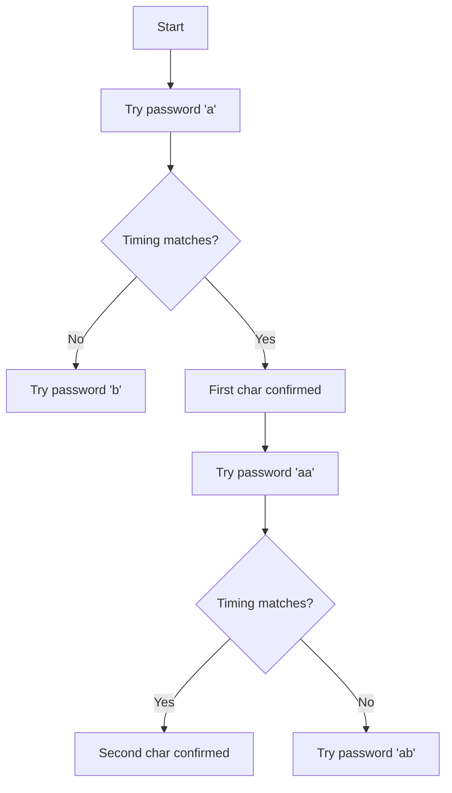

## The Problem

Web application login endpoints often leak information through response timing. A password comparison that short-circuits on the first incorrect character reveals *where* the match fails — and an attacker can measure these differences with statistically significant samples.

## Detecting Timing Leaks

Start with a baseline:

```python
import time
import requests

def measure(url: str, payload: dict, samples: int = 100) -> float:
    times = []
    for _ in range(samples):
        start = time.perf_counter()
        requests.post(url, json=payload)
        end = time.perf_counter()
        times.append(end - start)
    return sum(times) / len(times)
```

Compare timing for valid vs. invalid usernames:

```text
Valid user:     avg 142.3ms  std 3.1ms
Invalid user:   avg 138.1ms  std 2.8ms
Difference:     4.2ms
```

If the difference is statistically significant (t-test p < 0.01), the endpoint leaks username validity.

## Exploitation: Character-by-Character

For endpoints that compare passwords with `===` in JavaScript or `strcmp` in C, the comparison short-circuits:

```javascript
// Vulnerable pattern
function checkPassword(input, stored) {
    for (let i = 0; i < stored.length; i++) {
        if (input[i] !== stored[i]) return false;
    }
    return input.length === stored.length;
}
```

Each matching character adds ~nanoseconds, but over thousands of samples, the pattern emerges:



## Mitigation

Use constant-time comparison:

```python
import hmac

def verify(password: str, stored: str) -> bool:
    return hmac.compare_digest(password, stored)
```

Add jitter to responses:

```python
import random
import time

def login_response(success: bool):
    time.sleep(random.uniform(0.01, 0.03))
    return {"success": success}
```

Rate-limit by IP *before* credential verification, not after.
